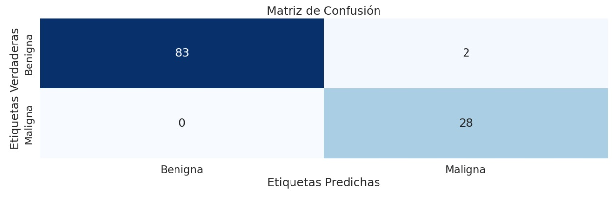

# Clasificación de Células Benignas y Malignas con SVM

## Descripción
Este proyecto tiene como objetivo clasificar células como benignas o malignas utilizando un algoritmo de aprendizaje supervisado: **Máquina de Soporte Vectorial (SVM)**. Se trabajó con el dataset *Breast Cancer Wisconsin* del repositorio de Machine Learning de la UCI, el cual contiene características morfológicas de células mamarias.

Se realizaron los siguientes pasos:
- Análisis exploratorio de datos.
- Limpieza, detección y tratamiento de outliers.
- Análisis de correlaciones.
- Entrenamiento y evaluación de distintos tipos de modelos de SVM.
- Elección y optimización del modelo con GridSearchCV.

---

## Dataset
- **Nombre**: Breast Cancer Wisconsin (Original)
- **Fuente**: [UCI Machine Learning Repository](http://mlearn.ics.uci.edu/MLRepository.html)
- **Observaciones**: 699 muestras
- **Variables**: 10 atributos relacionados con características celulares
- **Variable objetivo**:
  - 2: Benigna
  - 4: Maligna

## Tecnologías y Librerías Utilizadas
- Python 3.x
- pandas
- numpy
- matplotlib
- seaborn
- scikit-learn
- scipy

## Preprocesamiento
- Conversión de variables a tipo numérico.
- Eliminación de valores faltantes.
- Detección y eliminación de outliers.
- Análisis de correlaciones para evitar redundancia.
- Escalado de variables antes del entrenamiento

## Modelo de Clasificación: SVM
Se utilizó el modelo de clasificación **Máquina de Soporte Vectorial (Support Vector Machine)** con kernel lineal para clasificar las células.

## Evaluación y elección del modelo
El criterio que se utilizó para la elección del modelo fue el mejor clasificador de las células malignas, el cual, para una muestra de 113 casos predijo de manera correcta el total de células malignas con 2 falsos positivos (células benignas clasificadas erroneamente).

## Visualización:

## Código
Se puede explorar el código en GitHub: [Repositorio en GitHub](https://github.com/mpia87/clasificacion-de-celulas)
